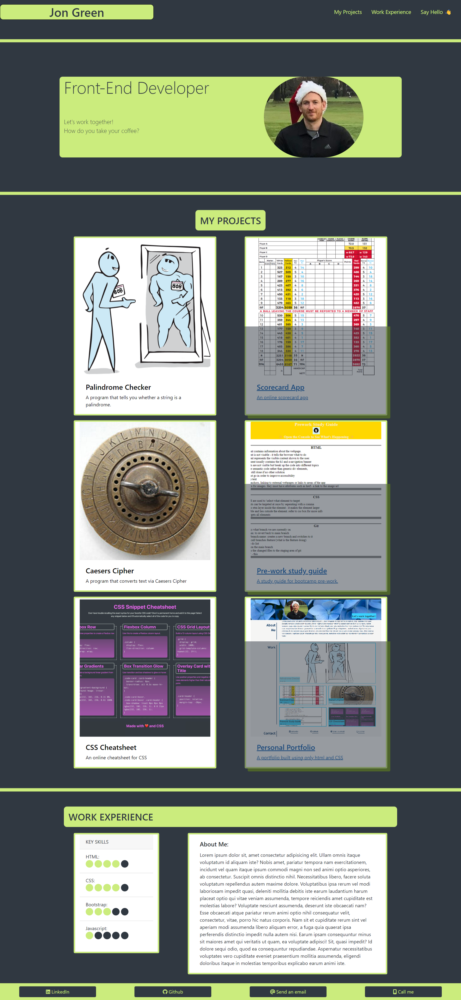

# Bootstrap-Portfolio

## Description
This is home to a personal portfolio of my work, built using Bootstrap as per the Module 3 Challenge of EDX bootcamp. It's purpose is to act as a home page for anyone interested in my work, ideally, potential clients and employers. The page aims to meet all the acceptance criteria required for the challenge, whilst simultaneously adding my own style and ensuring the page is responsive, à la what I learnt in Week 3 of the Front-End bootcamp.

## Table of contents

- [Installation](#installation)
- [Usage](#usage)
- [Credits](#credits)
- [License](#license)

## Installation
n/a 

## Usage
Open Web page and navigate to the projcects section by scrolling, or by clicking projects in the navbar. Click the link to view the project that is of interest to have it open in a new tab. Click the links in the footer to get in contact with me. 

Link to [Live-Page](https://jxg052.github.io/Bootstrap-Portfolio/)

## Credits

Thanks to edx bootcamp team for providing starter code and mockup. 

## License

MIT License

Copyright (c) 2022 JXG052

